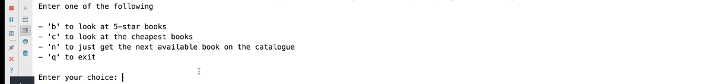

# Book Scraper Console App
> A books page scraper console application.

## Table of contents
* [General info](#general-info)
* [Screenshots](#screenshots)
* [Technologies](#technologies)
* [Setup](#setup)
* [Features](#features)
* [Status](#status)
* [Inspiration](#inspiration)
* [Contact](#contact)

## General info
The goal of this project is to show my portifolio to the world.

## Screenshots

## Technologies
* PyCharm
* Python
* BeautifulSoup
* logging
* requests
* time
* aiohttp
* async_timeout
* asyncio

## Setup
Since it was a simple app, there was not much setup required.

## Features
Features ready:
* Look at 5-star books
* Look at the cheapest books
* Get the next available book on the catalogue
* Quit the app

To-do list:
* None

## Status
Project is: _finished_

## Inspiration
Project based on online course I took on Udemy.

## Contact
Created by Julius Mushi - feel free to contact me!
